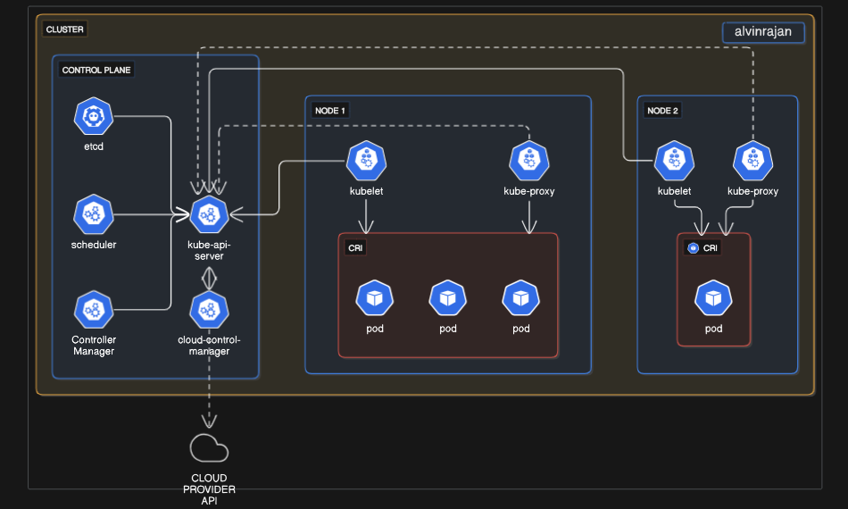

# eks-enterprise-kubernetes-deployment
End-to-End Kubernetes Project on Amazon EKS | Full Production-Grade CI/CD Pipeline with Helm, GitHub Actions, ALB Ingress, SSL, Monitoring, and Autoscaling for Microservices



Got it. You want **Kubernetes explained at the architectural and component level** so deeply that you can **create a project repo**, understand **every component inside the cluster**, and **how they interact internally** (control plane, data plane, networking, etc.), plus how this applies in **EKS (AWS managed Kubernetes)**.

Here’s the **detailed breakdown of Kubernetes core components and internal connectivity**, with DevOps and cloud (EKS) context.

---

## **1. Kubernetes Core Components Overview**

Kubernetes is split into **Control Plane** and **Worker Nodes**:

### **Control Plane (Cluster Brain)**

* **API Server (`kube-apiserver`)**

  * **Central communication hub** for all components.
  * Exposes REST API for cluster operations.
  * Handles all **kubectl commands**, controllers, and webhooks.
* **etcd**

  * **Cluster state database**.
  * Stores all Kubernetes objects (Pods, ConfigMaps, Secrets, etc.).
  * Highly available and **must maintain quorum** (majority of nodes).
* **Controller Manager**

  * Runs **controllers** that enforce desired state.
  * Examples:

    * **Deployment Controller** → ensures desired number of Pods.
    * **Node Controller** → detects node failures.
* **Scheduler**

  * Decides **which node a Pod runs on**.
  * Considers resource requests, affinity rules, and taints/tolerations.

---

### **Worker Nodes (Data Plane)**

* **Kubelet**

  * Agent running on each node.
  * Talks to API server, **ensures containers run as defined**.
* **Container Runtime**

  * Executes containers (Docker, containerd, CRI-O).
* **kube-proxy**

  * Handles **Pod networking and Services**.
  * Manages IP tables or IPVS for traffic routing.

---

## **2. Kubernetes Object Model**

Every resource in Kubernetes is an **API object**, stored in **etcd** and managed via **declarative YAML**:

* **Pods:** Smallest deployable unit, runs containers.
* **ReplicaSets:** Ensures Pod replicas.
* **Deployments:** Manages ReplicaSets for rolling updates.
* **Services:** Expose Pods within and outside the cluster.
* **ConfigMaps/Secrets:** App configuration & sensitive data.
* **Ingress:** Expose HTTP/S services externally.

---

## **3. Internal Communication Flow**

Here’s what happens **when you deploy a Pod**:

1. You apply YAML using `kubectl`.
2. **kubectl → API Server** (authenticated & authorized via RBAC).
3. API Server **stores the desired state** in etcd.
4. **Scheduler** watches API server → picks a node.
5. **Controller Manager** ensures Deployment → creates ReplicaSets → creates Pods.
6. **Kubelet on chosen node** sees Pod → pulls image → runs container via runtime.
7. **kube-proxy** configures networking → enables Service access.
8. **Pod starts** and reports status back to API Server → etcd updates.

---

## **4. Internal Connectivity**

* All control plane components **communicate via API server**.
* etcd only talks to API Server (not directly to Kubelet).
* Scheduler **never talks to nodes directly**, only to API server.
* Worker Nodes talk to API Server using **Kubelet** (secure channel).
* Networking inside cluster handled by **CNI plugin** (Calico, Flannel, AWS VPC CNI in EKS).

---

## **5. Kubernetes in EKS (AWS Context)**

* Control Plane:

  * **Managed by AWS** (API Server & etcd are AWS responsibility).
  * Highly available across **3 Availability Zones**.
* Worker Nodes:

  * **Managed by you** (EC2, Spot, Fargate).
  * Installed with **kubelet, kube-proxy, AWS VPC CNI**.
* Networking:

  * AWS VPC CNI → Pods get **VPC IP addresses**.
  * LoadBalancer Service → AWS creates **ELB/ALB/NLB**.
* Authentication:

  * Integrated with **AWS IAM** → mapped to Kubernetes RBAC using `aws-auth` ConfigMap.

---

## **6. Why Understanding Internal Components Matters for DevOps**

* Debugging cluster issues:

  * Pod stuck in `Pending`? → Check Scheduler & Node resources.
  * Deployment not updating? → Check Controller Manager.
* Designing HA clusters:

  * Ensure etcd **quorum** in self-managed clusters.
* Security:

  * Secure API Server endpoint.
  * Control RBAC and IRSA in EKS.

---

## **7. Hands-On: GitHub Repo Structure for Kubernetes Learning**

If you are creating a **GitHub repo for Kubernetes mastery**, structure it like this:

```
kubernetes-eks-learning/
│
├── 01-core-concepts/
│   ├── pods.yaml
│   ├── deployments.yaml
│   └── services.yaml
│
├── 02-networking/
│   ├── ingress.yaml
│   ├── network-policies.yaml
│
├── 03-storage/
│   ├── pv.yaml
│   ├── pvc.yaml
│   ├── statefulset.yaml
│
├── 04-scaling/
│   ├── hpa.yaml
│   └── cluster-autoscaler-config.md
│
├── 05-security/
│   ├── rbac-role.yaml
│   ├── pod-security.yaml
│
├── 06-observability/
│   ├── prometheus-grafana-setup.md
│
├── 07-eks-specific/
│   ├── eks-cluster-setup.md
│   ├── aws-auth-config.yaml
│
└── README.md
```

---
